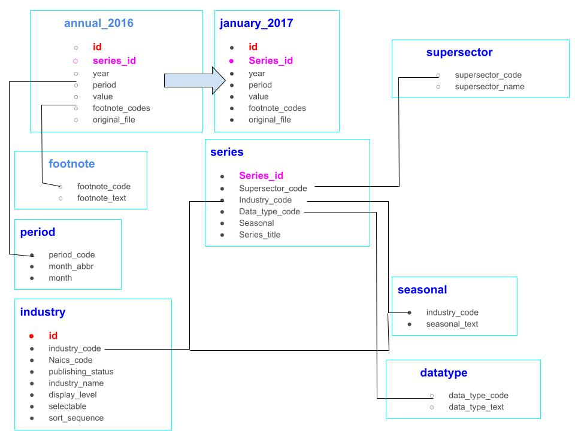

# Working 9to5 Project

# The Dataset
This project uses the Bureau of Labor Statistics (BLS) Current Employment Survey (CES) results which can be found on [Kaggle](https://www.kaggle.com/datasets/bls/employment).

# Business Issue
You are working for the Bureau of Labor Statistics with the United States government and have been approached by your boss with an important meeting request. You have been asked by your supervisor to meet with Dolly Parton whose nonprofit is looking to shed light on the state of employment in the United States. As part of the 9 to 5 project, their research is focused on production and nonsupervisory employees and how those employees fare compared to all employees in the United States. While the data the BLS collects from the CES is publicly available, Dolly Parton and her colleagues need your assistance navigating the thousands of rows in each table in LaborStatisticsDB.

## Tech used:
T-SQL, in Azure Data Studio

# Database model:

